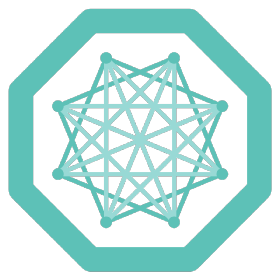

# Automatic Liver Segmentation Machine Learning Algorithm

 

 

## Overview

- This repository is the result of following [this tutorial](https://www.youtube.com/watch?v=M3ZWfamWrBM) from Freecodecamp regarding how to use [MONAI](https://monai.io/), an AI healthcare imaging machine learning framework, to create a deep learning model to segment a liver from a public CT scan
- The purpose of following this tutorial was to strengthen my machine learning skills by using a framework I have not used before, MONAI
- The content of this repository includes the required functionality for data preparation from 3D data, including the conversion of dicom files to nifti, preprocessing the data into test/train splits, and finally training and testing the model

## Content

### Data Preparation / Preprocess

- The data used for this project is 3D data, and the dataset used in the project comes in [dicom](https://www.dicomstandard.org/) format by default
- However MONAI uses the [nifti](<https://docs.safe.com/fme/html/FME-Form-Documentation/FME-ReadersWriters/nifti/nifti.htm#:~:text=NIfTI%20(Neuroimaging%20Informatics%20Technology%20Initiative)%20is%20a%20data%20format%20for,fMRI>) data format, so the data is initially converted from dicom to nifti
- The dataset is then converted into slices to standardize the dataset, in case multiple patients produce multiple sizes of slices of their data, and to ensure that the training of the model (by either CPU or GPU) can handle the size of the dataset
- The data is then split into test and training datasets
- There is another function (`show_patient`) which optionally allows you to visualise the dataset for one patient, to confirm if the data reformatting worked correctly

### Model Training

- The model architecture that is used is [UNET](https://paperswithcode.com/method/u-net#:~:text=U%2DNet%20is%20an%20architecture,architecture%20of%20a%20convolutional%20network.), specifically the architecture provided by MONAI
- Training the model is handled by the `train.py` file, and simply consists of using several functions provided by MONAI

### Model Testing

- Testing of the model is handled by the `testing.ipynb` notebook
- This notebook initially loads the locally saved models, and visualised their metric and Dice losses, to confirm the effectiveness of the model
- Then the notebook visualises one batch of data via three images; the slice of the CT scan, the corresponding segmentation sample from the data, and the model's output
- This is to confirm the model's effectiveness in successfully segmenting the data

## Example Outputs

### Graphical Dice and Metric Losses

### Liver Segmentation Example (CT scan slice, sample data, model output)

